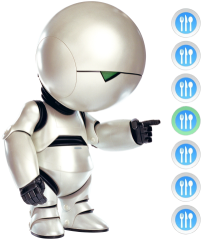

[Voting system for deciding where to have lunch](https://github.com/Tolka11/vote)
===============================

Spring/JPA application with authorization and role-based access rights without frontend. Using the  Java tools and technologies: Maven, Spring-Boot, Spring MVC, Security, JPA(Hibernate), REST(Jackson), H2 database.

### Application capabilities:
- 2 types of users: admin and regular users
  - Users can register and manage own profile
  - Admin can manage user profiles
- Admin can input a restaurant and it's lunch menu of the day (2-5 items usually, just a dish name and price)
  - Users can view information about restaurants
- Menu changes each day (admins do the updates)
  - Each restaurant provides a new menu each day
- Users can vote on which restaurant they want to have lunch at, and view the today rating
  - Admin can manage vote records 
- Only one vote counted per user, if user votes again the same day:
  - If it is before 11:00 we assume that he changed his mind
  - If it is after 11:00 then it is too late, vote can't be changed

-------------------

### REST API documentation: [Swagger on started application](localhost:8080/swagger-ui/index.html?configUrl=/v3/api-docs/swagger-config#/)
> - Run Application `RestaurantVotingApplication` 
> - Open API documentation by link: <a href="localhost:8080/swagger-ui/index.html?configUrl=/v3/api-docs/swagger-config#/">localhost:8080/swagger-ui/index.html?configUrl=/v3/api-docs/swagger-config#/</a>
> 
> Preset user : password
>   - admin@gmail.com : admin
>   - user@yandex.ru : password
-------------------

## Implementation features

#### H2 Database in memory with tables:
- **USERS** - contains user records
  - corresponds to the `User.class`
- **USER_ROLES** - contains user roles
  - corresponds to the `Role.enum`
- **RESTAURANT** - contains restaurant records 
  - corresponds to the `Restaurant.class`
  - unique constraints by fields `name` and `address`
- **DISH** - contains dish records
  - corresponds to the `Dish.class`
  - using to create menu for vote
  - store the history of menu changing for each restaurant
  - unique constraints by fields `name`, `restaurant_id` and `date`
  - indexes by fields `restaurant_id` and `date`
- **VOTE** - contains vote records
  - corresponds to the `Vote.class`
  - using to create day voting list
  - store the history of day voting list
  - unique constraints by fields `restaurant_id` and `date`
  - indexes by field `date`
- **CHOICE** - contains choice records
  - corresponds to the `Choice.class`
  - using to create day rating list
  - store the history of votes for each user
  - indexes by fields `user_id` and `date`
  - no unique constraints, because user can change choice several times per day, and return to first choice. Sort user choices by ID we can get last choice  

#### 3 caches configured:
- users 
- restaurants 
- votes

#### RatingMaker utility
Used to create voting rating by selected date, minimize accessing the database, and has: 
- Method `public Map<Integer, Integer> calculateRating(LocalDate date)` , that return Map where: *key - "vote id"* and *value - "number of votes"* for selected date. Admin Vote Controller use it for create rating by date. This method:
  - creates `Map< userId , voteId >` for get last user choice of day
  - based on user choice create rating of votes `Map< key - Vote id , value - number of votes >`
- Background thread that once per minute calculate today rating and store it in `private Map<Integer, Integer> rating`
- Method `public Map<Integer, Integer> getRating()` that return stored rating. Vote Controller use it for create today rating 

#### Model feauters

The main idea of model realisation is minimization database access. 

There are two classes for store history of menu dishes and user choices and corresponding tables in database - DISH and CHOICE. 

The most frequently requested data from database is daily voting list. This list creating from records of table VOTE represent by `Vote.class` objects for selected date. One such object is an option (variant) inside voting list and has minimum fields to support the voting process:
  - **id**
  - **name** - name of restaurant, for show to user in the voting list
  - **menu** - for show to user in the voting list, one String field, includes dish names with price, separated by semicolons
  - **restaurantId** - for make choice restaurant by id 
  - **date** - date of vote, to create voting list  for selected date

Admin creates Vote objects: 
- Admin get the restaurant with last menu from REST API, change dishes in menu and post restaurant with new menu to REST API 
- Method `createVote` in `AdminRestaurantController` get each dish from menu and stores them into DB table DISH with today date. Also, each dish converts to string `"dish_name - price; "` and appends in `StringBuilder menu`. For business lunch can be used only one `Dish.class` object, for example "Soup, cutlet, compote" with price. `Dish.class` objects save history of changing menu for each restaurant and could be use in future
- Then creating `Vote.class` object with `StringBuilder menu`, save it in database

Voting process by Users:
- User vote for the restaurant
- Method `makeChoice` in `VoteController` checks if it's the revote after 11-00, throw exception
- Else it creates new `Choice.class` object, and save it in database
- `Choice.class` objects save history of user choices and could be use in future

-------------------

> 2021. Anatoliy Skrylnikov. <a href="mailto:anatoliy.skrylnikov@gmail.com">anatoliy.skrylnikov@gmail.com</a>

-------------------
